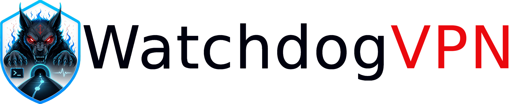
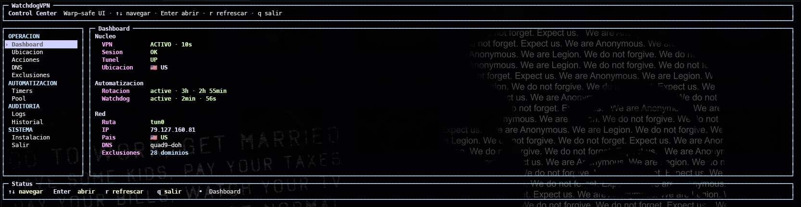

<p align="center">
  <picture>
    <source media="(prefers-color-scheme: dark)" srcset="docs/assets/branding/logo-horizontal-dark.png">
    <source media="(prefers-color-scheme: light)" srcset="docs/assets/branding/logo-horizontal-light.png">
    
  </picture>
</p>

[](https://github.com/GaboEI/WatchdogVPN/actions/workflows/ci.yml)

- **Status:** v2.0.0 in active development
- **Platform:** Linux
- **Interface:** CLI first, TUI after CLI-backed validation
- **License:** GPL-3.0-or-later. See [LICENSE](LICENSE).

WatchdogVPN is a local network control plane for resilient VPN/proxy routing on
Linux. It does not try to be a generic "connect button"; it manages privileged
network behavior such as routing policy, DNS policy, kill-switch state,
split-tunnel decisions, profile recovery and operator diagnostics from a
CLI-first architecture.

The project is built for networks where ordinary assumptions are not enough:
routes change, DNS fails, providers misreport state, endpoints degrade, DPI can
interfere with protocols, and a silent tunnel failure can put the user at risk.



## Why It Exists

Most VPN tools focus on starting a tunnel. WatchdogVPN focuses on the harder
operational question: **what is the machine really doing with traffic, DNS and
routes, and what should happen when protection degrades?**

WatchdogVPN is designed for users who need observable, recoverable connectivity
under unstable or censored network conditions: journalists, researchers,
developers, students, remote workers and people operating in restrictive
networks. It does not promise anonymity or magic bypass. It gives the operator
clear state, safer recovery paths and auditable decisions.

## Current v2 Foundation

The v2 line is being rebuilt in validated phases. The current repository already
contains the core foundation:

| Area | Current State |
| --- | --- |
| Daemon/runtime | daemon-backed runtime path with IPC and systemd integration |
| Profiles/providers | manual imports, subscription-backed providers and persistent stores |
| Protocol drivers | sing-box, AmneziaWG, OpenVPN and OpenVPN+Cloak driver paths |
| Rotation/recovery | controlled rotation, cooldowns, known-good handling and failure categories |
| Kill switch | nftables/iptables fail-closed model with DNS leak ordering |
| DNS v2 | DNS policy model, resolver testing, TUN hijack, FakeIP, ECS, static IP mappings and rollback |
| Routing rules | persistent rule groups, rule engine and sing-box route generation |
| Installer/update | non-destructive install/update contracts with backup and validation |
| Audits | phase-level QA audits with HIGH/MEDIUM findings fixed before advancement |

## Active Roadmap Before v2.0.0

These are planned phases, not current user-facing promises:

| Phase | Goal |
| --- | --- |
| Linux split tunneling / app policy | route selected Linux processes through VPN, direct, auto-selected group or block |
| Policy diagnostics | explain why traffic matches a rule and where it should go |
| Node groups / auto-selection | named node groups with health-aware selection |
| DNS/network hardening | refine DNS diagnostics, time checks and LAN-service decisions |
| Privacy-preserving observability | aggregate stats without silently logging sensitive browsing history |
| Backup/restore/sync | safe versioned backups, restore rollback and remote-sync threat review |
| Routing/capture architecture | align Rule/Global, Proxy/TUN/LAN and route actions before final CLI |
| LAN sharing / gateway mode | branch-gated LAN proxy and gateway capability for network operators |
| Network context automation and diagnostics | network-aware activation plus unified diagnostics before final CLI |
| Full CLI | complete operator surface after capabilities settle |
| Field validation | real CLI-driven validation before final TUI work |
| TUI premium experience | final v2 TUI over proven behavior |

Detailed sequencing lives in the local master plan used by the maintainer. The
public roadmap summary is in [ROADMAP.md](ROADMAP.md).

Phase 17 keeps automatic remote backup sync deferred. The supported portable
workflow is explicit ZIP export/import, preferably encrypted before moving the
archive off the local machine.

Before the final CLI is frozen, WatchdogVPN will align its routing model so
Rule/Global are routing policies, Proxy/TUN/LAN are capture or entry
mechanisms, and Direct/Current/Block/Group are route actions. After that,
WatchdogVPN is expected to grow a carefully gated LAN sharing track for network
operators: LAN proxy sharing and, later, full gateway/router mode for devices
that intentionally use the WatchdogVPN host as their protected path. That work
is not enabled in the current mainline runtime; it requires a dedicated branch,
VM-only network validation, explicit bind/firewall controls, kill-switch
coverage and DNS leak validation before merge.

Before the final CLI is frozen, WatchdogVPN will also add network-context
automation and unified diagnostics. That track is expected to cover
trusted/untrusted network policy, interface/default-route changes, safe
autoconnect behavior, provider update metadata and redacted support exports.
Automatic behavior must be explainable and reversible, and diagnostics must not
silently become browsing history or a secret dump.

## Protocol Support

WatchdogVPN separates **resilient profile families** from **standard
compatibility profiles**. This distinction matters: supporting a protocol does
not automatically mean it is appropriate for hostile DPI environments.

| Category | Protocol Families |
| --- | --- |
| Resilient / anti-DPI oriented | VLESS+Reality, Trojan TLS/uTLS, Hysteria2, AmneziaWG, OpenVPN+Cloak/OverCloud |
| Compatibility | plain WireGuard, VMess, standard Shadowsocks, SOCKS, HTTP, normal OpenVPN |
| Conditional | TUIC and Shadowsocks may be treated as resilient only when configured and validated for restrictive networks |

Compatibility profiles are useful, but WatchdogVPN should not describe them as
censorship-resistant unless the concrete configuration has been validated.

## Core Concepts

### Real-State Verification

Provider status text is not treated as truth. WatchdogVPN checks observable
state such as tunnel interface, route, DNS behavior and public IP where
appropriate.

### Recovery With User Intent

The runtime distinguishes automatic recovery from a user-requested manual stop.
If the user deliberately turns the VPN off, automation must not immediately
fight that decision.

### DNS Safety

DNS v2 is part of the product, not an afterthought. WatchdogVPN can model DNS
channels, apply local resolver state with rollback, hijack application DNS into
the tunnel path and avoid LAN resolver leaks when the kill switch is active.

### Explicit Traffic Policy

Routing rules make traffic decisions inspectable. The v2 roadmap extends this
into Linux app/process policy, rule explanations and node-group routing.

### Non-Destructive Operations

Install, update, uninstall and restore flows must preserve user configuration
unless the user explicitly approves destructive behavior.

## Installation

WatchdogVPN is currently Linux-focused. Run it from a checkout:

```sh
git clone https://github.com/GaboEI/WatchdogVPN.git
cd WatchdogVPN
./doctor.sh
./install.sh
```

Launch the current TUI:

```sh
VPN
```

Run the product CLI:

```sh
watchdogvpn --help
```

`doctor.sh` is read-only. It checks whether the machine has the expected
dependencies, runtime state and time/NTP health. It reports clock skew as a
connectivity risk; it does not change system time.

## Updating

```sh
cd WatchdogVPN
git pull
./update.sh
```

The updater validates the checkout, backs up managed files and preserves user
configuration, logs, shared runtime state and DNS configuration.

## Uninstalling

```sh
cd WatchdogVPN
./uninstall.sh
```

Guided uninstall choices are available through the Python CLI:

```sh
cd WatchdogVPN
watchdog uninstall --keep-data --yes
watchdog uninstall --backup-first --backup-output ~/watchdogvpn-backup.zip --yes
watchdog uninstall --delete-all-data --confirm-delete DELETE --backup-output ~/watchdogvpn-pre-delete.zip --yes
```

Full product purge:

```sh
cd WatchdogVPN
./uninstall.sh --purge-config --purge-logs --purge-state --confirm-delete DELETE
```

Uninstall does not remove user-owned VPN/proxy provider software, private keys,
profiles or account state unless an explicit future contract says otherwise.

## For Providers

WatchdogVPN is provider-agnostic. It can accept compatible subscription/profile
formats without depending on or endorsing any specific provider.

Provider collaboration is welcome when it improves interoperability. See
[Provider Collaboration](docs/providers.md) for accepted formats, expectations
and submission guidance.

## For Contributors

Useful contributions include:

- protocol/profile parser fixtures;
- distro validation;
- documentation corrections;
- tests for installer, DNS, routing, daemon and recovery behavior;
- carefully scoped bug reports with sanitized logs.

Before opening an issue, read [Reporting Issues](docs/reporting.md) and
[Security Policy](SECURITY.md), especially if logs may reveal network or account
details.

## Repository Layout

```text
bin/        User-facing helper commands
cli/        Python CLI surface for v2 functionality
config/     Persistent stores and application config
core/       Runtime orchestration
daemon/     daemon IPC and worker entrypoints
dns/        DNS v2 policy, testing and apply/restore logic
drivers/    Protocol/runtime drivers
models/     Shared data models
providers/  Manual and subscription provider imports
rotation/   Health checks, rotation and recovery
rules/      Routing rule models, parser and sing-box generation
systemd/    Services and timers
tui/        Terminal UI
docs/       Architecture, security, validation and release docs
tests/      Unit, syntax and runtime contract tests
```

## Validation

Common local checks:

```sh
python3 -m unittest discover tests
bash tests/unit.sh
bash tests/syntax.sh
systemd-analyze verify systemd/*.service systemd/*.timer
./doctor.sh
```

Some validations require an installed system target or privileges. They are run
manually and documented in phase/audit notes when needed.

## Documentation

- [Architecture](docs/architecture.md)
- [CLI](docs/cli.md)
- [Configuration](docs/configuration.md)
- [DNS CLI](docs/dns-cli.md)
- [Security](docs/security.md)
- [Threat Model](docs/threat-model.md)
- [Validation](docs/validation.md)
- [Demo](docs/demo.md)
- [Provider Collaboration](docs/providers.md)
- [Roadmap](ROADMAP.md)
- [Changelog](CHANGELOG.md)

## Safety Rule

WatchdogVPN must preserve existing user configuration unless the user
explicitly approves a change. When a feature touches DNS, routing, daemon state,
privileged files or installed runtime paths, unit tests are not enough: the
behavior must be validated against the real machine or a faithful system-level
test.

## License

WatchdogVPN is licensed under GPL-3.0-or-later. You may use, study, modify and
redistribute it under the terms of the GNU General Public License version 3 or
any later version.
