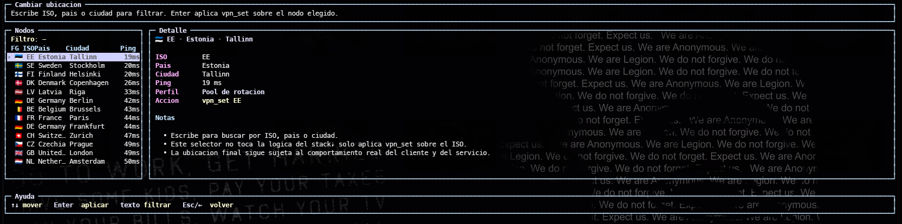
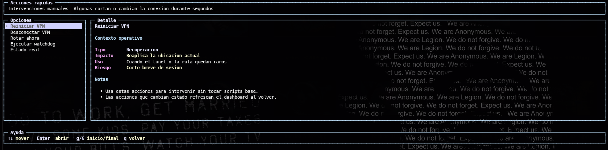
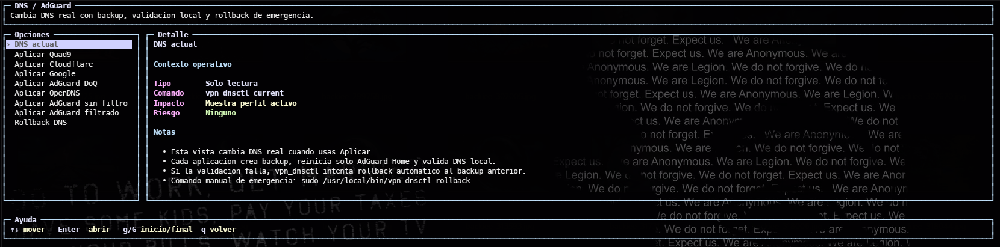
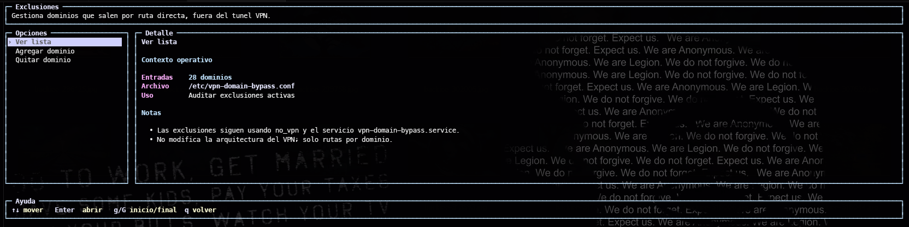
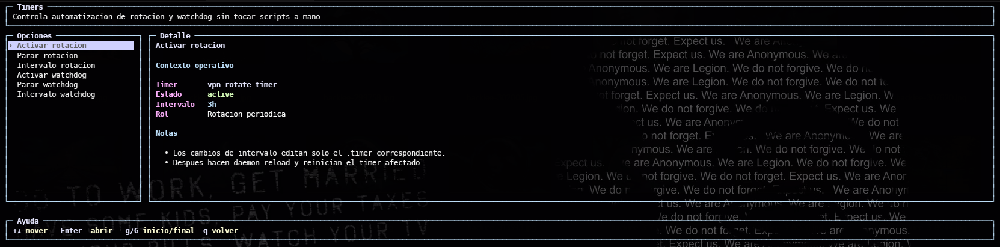
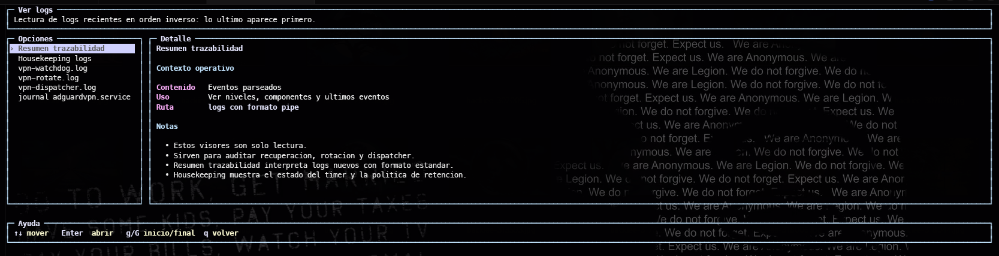

# Demo and Validation Examples

This page shows the current WatchdogVPN terminal interface and representative
command output from a healthy installation.

The screenshots are captured from the real TUI, not a web mockup.

## TUI Screenshots

### Dashboard


The dashboard is the first operational view. It shows the real VPN state,
session health, tunnel state, selected location, route, public IP, DNS profile,
active exclusions and automation timers.

### Location Selection



The location view lists candidate VPN locations with country, city and ping. It
lets the user choose a location without touching `adguardvpn-cli` directly.

### Recovery Actions



The actions view exposes manual recovery operations for cases where the user
wants to intervene immediately.

### DNS Profiles



DNS changes are handled as explicit actions with backup, local validation and
rollback support.

### Domain Exclusions



Exclusions are user-owned domain rules for services that should leave through
the normal network route instead of the VPN route.

### Timers



The TUI exposes only user-relevant automation controls. Watchdog interval and
rotation interval are product preferences; internal housekeeping timers remain
implementation details.

### Logs



The logs view is read-only and is intended for quick diagnostics without making
the user open individual log files manually.

## Example: Doctor

`doctor.sh` is read-only. It checks the host, repository runtime and current
installation before install/update work is performed.

```text
$ ./doctor.sh
WatchdogVPN - Doctor
Read-only preflight. No system changes will be made.

== Distro ==
[INFO] distro: Ubuntu 24.04.4 LTS (ubuntu)
[OK] distro supported
[OK] distro adapter: distros/ubuntu.sh
[INFO] package manager: apt

== System ==
[OK] init: systemd
[OK] command: bash
[OK] command: python3
[OK] command: curl
[OK] command: ip
[OK] command: systemctl
[OK] command: sudo
[OK] command: logrotate
[OK] NetworkManager active

== AdGuard VPN ==
[OK] adguardvpn-cli detected: /usr/local/bin/adguardvpn-cli
[INFO] version: AdGuard VPN CLI v1.7.12
[OK] service user: adgvpn
[OK] auth: OK

== Network And DNS ==
[OK] truth state: UP
[OK] HTTPS connectivity

== Result ==
OK=45 WARN=0 FAIL=0
Result: OK
```

## Example: Real VPN Status

`vpnctl status` reports the truth layer result rather than blindly trusting the
provider CLI text.

```text
$ vpnctl status
VPN STATUS: UP (REAL)

tun0: UP
route: TUN
public ip: 185.174.159.38

CLI status: VPN is disconnected (not authoritative)
```

The CLI line is intentionally treated as non-authoritative. The tunnel, route
and public IP checks are the operational source of truth.

## Example: DNS Profile

```text
$ vpn_dnsctl current
== AdGuard Home DNS current ==
config=/opt/AdGuardHome/AdGuardHome.yaml
profile_guess=quad9-doh

upstream_dns:
  - https://dns10.quad9.net/dns-query
  - https://dns11.quad9.net/dns-query
bootstrap_dns:
  - 9.9.9.10
  - 149.112.112.10
fallback_dns:
  - https://cloudflare-dns.com/dns-query
  - https://dns.google/dns-query
```

## Example: Timers

```text
$ systemctl list-timers --all vpn-watchdog.timer vpn-rotate.timer vpn-domain-bypass.timer myvpn-logrotate.timer --no-pager
NEXT                         LEFT    LAST                         PASSED  UNIT                    ACTIVATES
20:04:09 MSK                 2min    20:02:06 MSK                 5s ago  vpn-watchdog.timer      vpn-watchdog.service
20:10:02 MSK                 7min    20:00:01 MSK                 2min    vpn-domain-bypass.timer vpn-domain-bypass.service
21:00:00 MSK                 57min   20:00:00 MSK                 2min    myvpn-logrotate.timer   myvpn-logrotate.service
22:40:59 MSK                 2h 38m  19:40:48 MSK                 21min   vpn-rotate.timer        vpn-rotate.service
```

`vpn-rotate.timer` is intentionally slower than the watchdog and bypass timers.
It changes the VPN location and restarts the provider service, so it should not
run aggressively during normal use.

## Install, Update and Uninstall

```sh
git clone https://github.com/GaboEI/WatchdogVPN.git
cd WatchdogVPN
./doctor.sh
./install.sh
VPN
```

```sh
cd WatchdogVPN
git pull
./update.sh
```

```sh
cd WatchdogVPN
./uninstall.sh
```

For full removal of WatchdogVPN-managed files, logs, state and optional Conky
files:

```sh
./uninstall.sh --purge-config --purge-logs --purge-state --purge-conky
```

The official AdGuard VPN CLI and the user's AdGuard account/license state are
not removed by WatchdogVPN uninstall.
